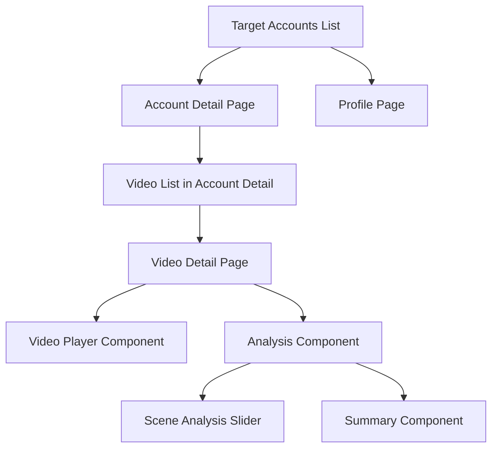

# Target Accounts UI Enhancement Design

## Overview

This design document outlines the comprehensive enhancement of the Target Accounts feature, focusing on improving user experience through streamlined UI, new detail pages, and enhanced navigation. The design builds upon the existing implementation while introducing three main components: enhanced account list, account detail pages, and video detail pages.

## Architecture

### Current State Analysis

The current implementation includes:
- Target Accounts list page with table view
- Basic CRUD operations for accounts
- Integration with crawl management and video management
- Context-based state management
- API integration with `/api/analysis` endpoints

### Enhanced Architecture



## Components and Interfaces

### 1. Enhanced Target Accounts List

#### UI Changes
- **Remove Platform Column**: Simplify the table by removing platform information
- **Clickable Avatar**: Avatar clicks navigate to profile page (external link)
- **Clickable Row**: Row clicks navigate to account detail page
- **Simplified Actions**: Only show Edit and Delete buttons in expanded form

#### Component Structure
```typescript
interface EnhancedAccountListProps {
  accounts: TargetAccount[]
  onAccountClick: (accountId: string) => void
  onAvatarClick: (profileUrl: string) => void
  onEdit: (account: TargetAccount) => void
  onDelete: (account: TargetAccount) => void
}
```

#### Implementation Details
- Update table columns to exclude platform
- Add click handlers for row and avatar interactions
- Replace dropdown menu with expanded button layout
- Maintain existing filtering and search functionality

### 2. Account Detail Page

#### Page Structure
```typescript
interface AccountDetailPageProps {
  accountId: string
}

interface AccountStats {
  subscriberCount: number
  description: string
  createdAt: string
  totalVideos: number
  totalViews: number
  lastPublishedAt: string
}
```

#### Components

##### Statistics Section
- Display key account metrics in card layout
- Show subscriber count, description, creation date
- Include total videos, views, and last publish date
- Handle missing data with appropriate placeholders

##### Video Management Section
- Filtering controls for video list
- Batch selection for multiple videos
- Bulk download functionality
- Status indicators for download/analysis states

##### Video List Component
```typescript
interface VideoListItem {
  id: string
  thumbnailUrl: string
  title: string
  viewCount: number
  likeCount: number
  commentCount: number
  publishedAt: string
  downloadStatus: 'not_downloaded' | 'downloaded' | 'analyzed'
}
```

### 3. Video Detail Page

#### Page Structure
```typescript
interface VideoDetailPageProps {
  videoId: string
}

interface VideoDetails {
  id: string
  title: string
  description: string
  duration: number
  viewCount: number
  likeCount: number
  commentCount: number
  publishedAt: string
  thumbnailUrl: string
  videoUrl: string
  isDownloaded: boolean
  isAnalyzed: boolean
  localFilePath?: string
}
```

#### Components

##### Video Player/Thumbnail Component
```typescript
interface VideoPlayerProps {
  video: VideoDetails
  onDownloadRequest: (videoId: string) => void
}
```

##### Video Information Component
- Display all video metadata
- Show engagement metrics
- Handle missing information gracefully

##### Analysis Component
```typescript
interface AnalysisComponentProps {
  videoId: string
  analysisData?: VideoAnalysis
  onAnalyzeRequest: (videoId: string) => void
}

interface VideoAnalysis {
  scenes: SceneData[]
  summary: string
}

interface SceneData {
  imageUrl: string
  description: string
  timeRange: {
    start: number
    end: number
  }
}
```

##### Scene Analysis Slider
- Horizontal scrolling component for scene thumbnails
- Each scene shows image, description, and time range
- Click to navigate to specific time in video

## Data Models

### Enhanced API Integration

#### Account Statistics API
```typescript
interface AccountStatisticsResponse {
  subscriberCount: number
  description: string
  createdAt: string
  totalVideos: number
  totalViews: number
  lastPublishedAt: string
}
```

#### Video Analysis API
```typescript
interface VideoAnalysisResponse {
  id: string
  videoId: string
  scenes: SceneAnalysis[]
  summary: string
  analysisStatus: 'pending' | 'processing' | 'completed' | 'failed'
  createdAt: string
  updatedAt: string
}

interface SceneAnalysis {
  sceneId: string
  startTime: number
  endTime: number
  thumbnailUrl: string
  description: string
  confidence: number
}
```

### State Management

#### Account Detail Context
```typescript
interface AccountDetailContextType {
  account: TargetAccount | null
  accountStats: AccountStatistics | null
  videos: Video[]
  loading: boolean
  error: string | null
  
  // Actions
  fetchAccountDetail: (accountId: string) => Promise<void>
  fetchAccountVideos: (accountId: string, filters?: VideoFilters) => Promise<void>
  triggerBatchDownload: (videoIds: string[]) => Promise<void>
  filterVideos: (filters: VideoFilters) => void
}
```

#### Video Detail Context
```typescript
interface VideoDetailContextType {
  video: VideoDetails | null
  analysis: VideoAnalysis | null
  loading: boolean
  error: string | null
  
  // Actions
  fetchVideoDetail: (videoId: string) => Promise<void>
  triggerDownload: (videoId: string) => Promise<void>
  triggerAnalysis: (videoId: string) => Promise<void>
  fetchAnalysis: (videoId: string) => Promise<void>
}
```

## Error Handling

### Error States
1. **Network Errors**: Show retry options with clear error messages
2. **Missing Data**: Display appropriate placeholders and fallbacks
3. **Permission Errors**: Guide users to required actions
4. **Analysis Failures**: Provide retry mechanisms and error details

### Loading States
1. **Skeleton Loading**: Use skeleton components for initial data loading
2. **Progressive Loading**: Load critical data first, then supplementary information
3. **Action Feedback**: Show loading states for user actions (download, analyze)

## Testing Strategy

### Unit Tests
- Component rendering with various data states
- User interaction handlers
- State management logic
- API integration functions

### Integration Tests
- Navigation flow between pages
- Data consistency across components
- Error handling scenarios
- Responsive behavior

### E2E Tests
- Complete user workflows
- Cross-page navigation
- Batch operations
- Video playback and analysis

## Performance Considerations

### Optimization Strategies
1. **Lazy Loading**: Load video thumbnails and analysis data on demand
2. **Virtual Scrolling**: Handle large video lists efficiently
3. **Caching**: Cache account and video data to reduce API calls
4. **Image Optimization**: Optimize thumbnail loading and display

### Memory Management
- Clean up video player resources when navigating away
- Implement proper component unmounting
- Use React.memo for expensive components

## Accessibility

### WCAG Compliance
- Proper heading hierarchy
- Keyboard navigation support
- Screen reader compatibility
- Color contrast compliance
- Focus management

### Interactive Elements
- Clear focus indicators
- Accessible button labels
- Proper ARIA attributes
- Alternative text for images

## Responsive Design

### Breakpoint Strategy
- **Mobile (< 768px)**: Stack components vertically, simplified navigation
- **Tablet (768px - 1024px)**: Adaptive grid layouts, touch-friendly controls
- **Desktop (> 1024px)**: Full feature set, optimized for mouse interaction

### Component Adaptations
- Responsive video player sizing
- Adaptive scene slider for touch devices
- Collapsible sections on smaller screens
- Touch-friendly batch selection

## Security Considerations

### Data Protection
- Sanitize user inputs
- Validate API responses
- Secure video file access
- Protect sensitive account information

### Authentication
- Verify user permissions for account access
- Secure video download endpoints
- Protect analysis data access

## Migration Strategy

### Phase 1: Enhanced Account List
- Update existing table component
- Implement new click handlers
- Test navigation flows

### Phase 2: Account Detail Page
- Create new route and components
- Implement statistics display
- Add video filtering and batch operations

### Phase 3: Video Detail Page
- Create video detail route
- Implement video player component
- Add analysis visualization

### Phase 4: Analysis Features
- Implement scene analysis slider
- Add analysis summary component
- Integrate with analysis API

## Success Metrics

### User Experience
- Reduced clicks to access video details
- Improved task completion rates
- Decreased user error rates
- Positive user feedback scores

### Performance
- Page load times under 2 seconds
- Smooth video playback
- Responsive UI interactions
- Efficient API usage

### Technical
- Code coverage above 80%
- Zero critical accessibility issues
- Cross-browser compatibility
- Mobile responsiveness compliance